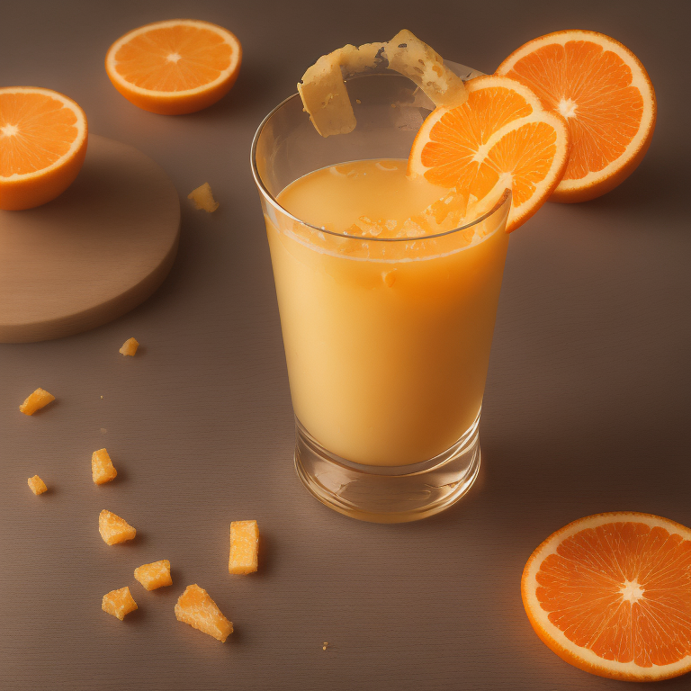
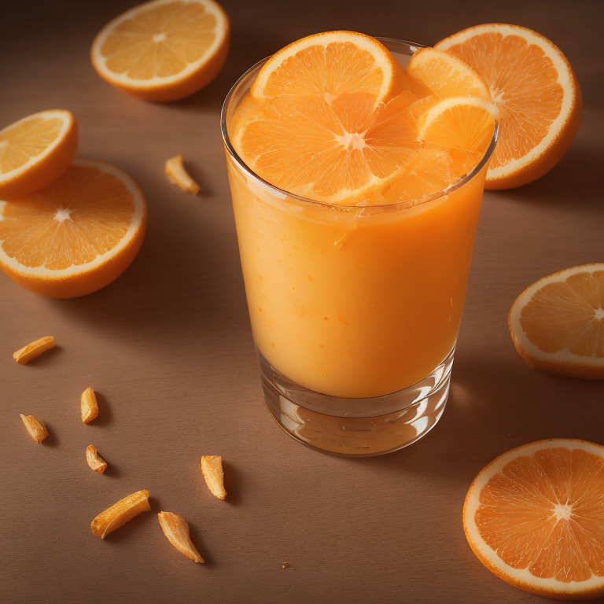

# Image-to-Prompt Inversion via LLM-Guided Evolutionary Search
### A Training-Free VLM → OPRO → Genetic Algorithm Pipeline

> João Vaz and Leonardo Silva — Department of Informatics Engineering, University of Coimbra

| Target | Top-1 Recovered |
|---|---|
|  |  |
|  |  |


---

## Overview

This project implements a training-free, three-phase pipeline for **image-to-prompt inversion**: recovering a text prompt that, when rendered by a fixed text-to-image generator ([LCM_Dreamshaper_v7](https://huggingface.co/SimianLuo/LCM_Dreamshaper_v7)), reproduces a target image as faithfully as possible.

Pipeline stages:
- **VLM Initialization** — Qwen3-VL-8B generates 10 diverse dimension-guided candidates from the target image
- **OPRO Optimization** — Qwen2.5-VL-7B iteratively refines candidates using a fitness-scored history
- **Genetic Algorithm** — Qwen2.5-7B-Instruct evolves the population via LLM-guided crossover and mutation, with an optional **SAGE** (Spatial-Aware Genetic Evolution) crossover variant

[Read the full report](./Report.pdf)

---

## Results

Best-candidate metrics after each phase, averaged across 6 target images and 5 runs:

| Phase | Fitness ↑ | CLIP ↑ | LPIPS ↓ | RMSE ↓ |
|---|---|---|---|---|
| VLM Initialization | 0.7213 | 0.8140 | 0.6126 | 0.1815 |
| + OPRO Optimization | 0.7645 | 0.8627 | 0.5074 | 0.1520 |
| **+ Genetic Algorithm** | **0.7860** | **0.8811** | **0.4521** | **0.1357** |

Best fitness per target image:

| Image | Best Fitness |
|---|---|
| Orange Juice | 0.839 |
| Space | 0.837 |
| Palm Tree | 0.792 |
| Hedgehog | 0.780 |
| Hamster | 0.774 |
| Warrior | 0.757 |

The full pipeline achieves a mean fitness gain of **+0.065** over the VLM baseline, surpassing it on every target image. More per-image comparisons (top-3 candidates for all 6 targets) are available in `GLOBAL_TOP_3_RESULTS/`.

---

## Project Structure

```
.
├── README.md
├── Report.pdf                # Final report
├── Code_automated.ipynb      # Pipeline v1: VLM → OPRO → GA
├── Code_automated2.ipynb     # Pipeline v2: adds the SAGE crossover extension
├── tp2-chosen/                # Target images
├── outputs/                   # Generated outputs (per-run checkpoints and images)
├── GLOBAL_TOP_3_RESULTS/      # Top-3 recovered prompts/metrics per target
├── utils/                     # Scripts to extract results from JSON checkpoints
└── src/                       # Custom modules loaded via Google Drive (fitness, vlm, opro, ga, etc.)
```

---

## Installation

```bash
pip install "diffusers[torch]" transformers accelerate safetensors matplotlib lpips "pandas<3" "Pillow<12"
```

> Notebooks pin `Pillow<12` and `pandas<3` to avoid compatibility issues on Colab/VS Code.

**Hardware:** experiments were run on Google Colab Pro (A100, 40 GB VRAM), models loaded in bfloat16. A full pipeline run takes ~23 minutes.

---

## Running the Pipeline

1. Open `Code_automated.ipynb` (base pipeline) or `Code_automated2.ipynb` (SAGE extension).
2. Run the first cell — installs dependencies and sets `PYTORCH_ALLOC_CONF` for VRAM handling.
3. Mount Google Drive (optional) and place target images in `tp2-chosen/` (locally or in `MyDrive/GENAI_TP2/tp2-chosen/`), or provide a `tp2-chosen.zip`.
4. Set `TARGET_IMAGE` and `NUM_RUNS`.
5. Run top to bottom. Each run:
   - Generates the initial VLM candidate population (Phase 1)
   - Refines it via OPRO (Phase 2)
   - Evolves it via GA or SAGE crossover (Phase 3)
   - Saves best images, top-3 ranked prompts, and JSON checkpoints under `outputs/run_<timestamp>_TARGET_<id>/`

---

## Fitness Function

```
F = 0.4 × CLIP + 0.5 × 1/(LPIPS + 1) + 0.1 × 1/(RMSE + 1)
```

CLIP image-image similarity captures semantic alignment, LPIPS (highest weight) captures perceptual similarity, and RMSE captures low-level pixel accuracy.

---

## Ablation: Baseline GA vs. SAGE

Best candidate and population-mean fitness (µ ± σ, 5 runs):

| Image | Base best | SAGE best | Base pop | SAGE pop |
|---|---|---|---|---|
| Orange Juice | 0.8336 ± 0.0045 | 0.8280 ± 0.0058 | 0.8210 ± 0.0084 | 0.8147 ± 0.0070 |
| Palm Tree | 0.7776 ± 0.0085 | 0.7677 ± 0.0051 | 0.7656 ± 0.0063 | 0.7561 ± 0.0055 |
| Warrior | 0.7465 ± 0.0067 | 0.7343 ± 0.0013 | 0.7356 ± 0.0061 | 0.7245 ± 0.0042 |
| **Hedgehog** | 0.7689 ± 0.0060 | 0.7682 ± 0.0095 | 0.7468 ± 0.0090 | **0.7528 ± 0.0093** |
| Space | 0.8247 ± 0.0085 | 0.8139 ± 0.0029 | 0.8126 ± 0.0093 | 0.8005 ± 0.0074 |
| Hamster | 0.7631 ± 0.0067 | 0.7631 ± 0.0100 | 0.7530 ± 0.0078 | 0.7428 ± 0.0089 |
| **Mean (6 images)** | **0.7860** | 0.7791 | **0.7727** | 0.7651 |

SAGE underperforms the baseline GA on best-candidate fitness for 5 of 6 images, but improves population fitness on Hedgehog — the target that originally motivated it, where different image regions favor different candidates. Attributed to the limited spatial reasoning of the 7B VLM, the coarse 2×2 grid, and the absence of spatial feedback during mutation.

---
